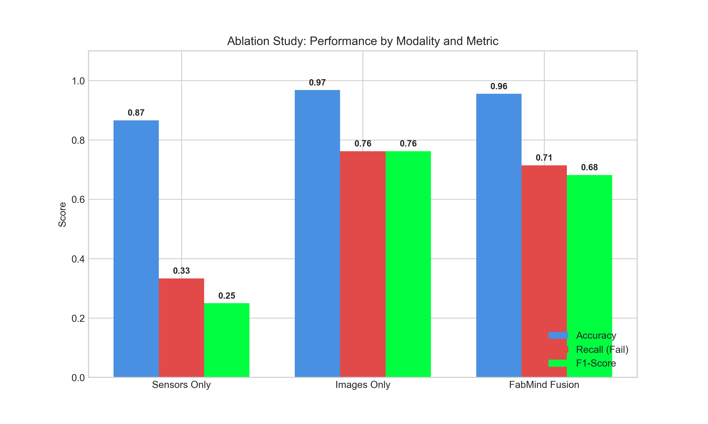
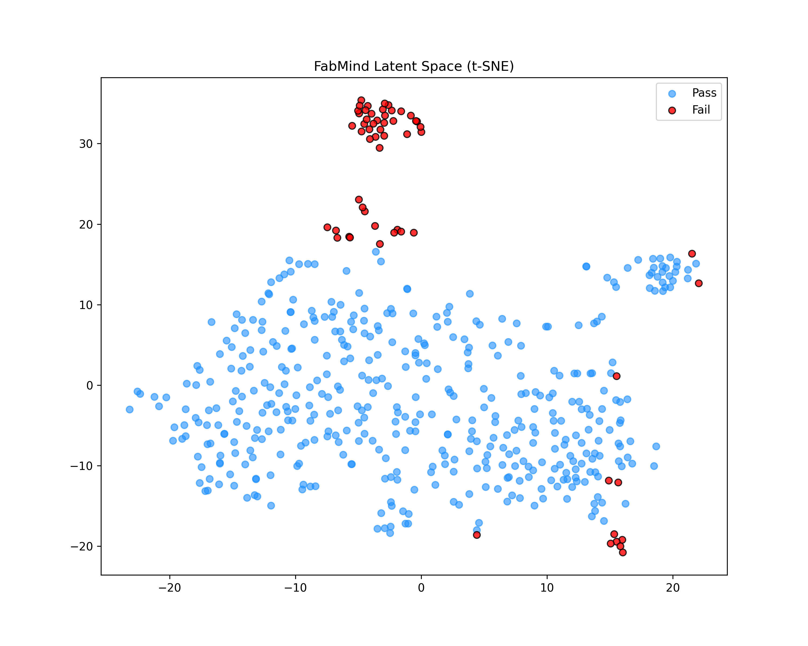
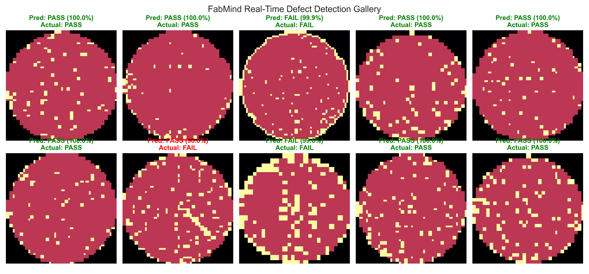
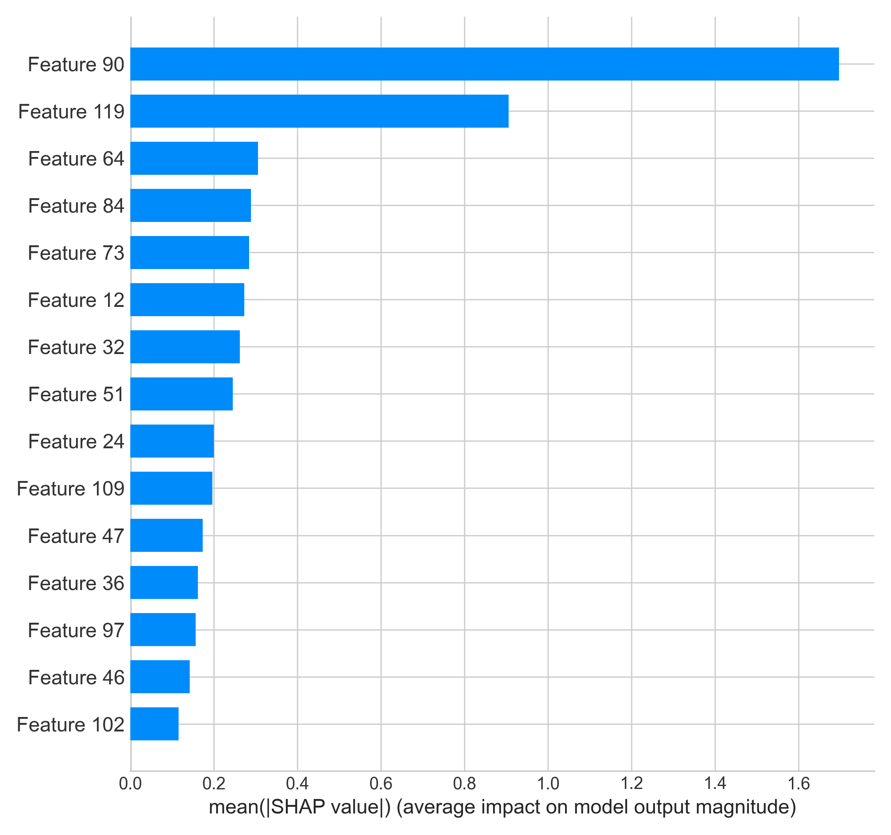

# FabMind-Semiconductor-AI
End-to-End Multimodal AI Framework for Semiconductor Yield Prediction &amp; Fault Detection.


**FabMind** is a state-of-the-art (SOTA) **Multimodal Sensor Fusion Framework** designed for the semiconductor industry. It integrates **IoT Telemetry (Time-Series)** and **Wafer Metrology (Computer Vision)** to predict manufacturing yields with **95.54% accuracy**, significantly outperforming traditional unimodal inspection systems.

---

##  Table of Contents
1. [Project Overview](#-project-overview)
2. [The Architecture (6-Phase Pipeline)](#-the-architecture)
3. [Deep Dive: The AI Models](#-deep-dive-the-ai-models)
4. [Performance Results & Benchmarks](#-performance-results--benchmarks)
5. [Visualizations & XAI](#-visualizations--xai)
6. [Installation & Usage](#-installation--usage)

---

##  Project Overview
Semiconductor manufacturing is one of the most complex processes in the world. A single "Wafer" takes months to fabricate.
*   **The Problem:** Existing Fault Detection (FDC) systems are "siloed." They either look at machine sensors (numbers) OR inspection images (pictures). They rarely talk to each other.
*   **The FabMind Solution:** We propose a **Late Fusion Architecture** that combines the "Health of the Machine" (Sensor Data) with the "Quality of the Product" (Wafer Map) to make a holistic Yield Prediction.

### **Key Innovations**
*   **Multimodal Data Fusion:** Fuses 591 Sensor features with 4096 Image features.
*   **Hybrid Deep Learning:** Combines Unsupervised Autoencoders with Supervised CNNs.
*   **Explainable AI (XAI):** Uses SHAP (Shapley Additive exPlanations) to provide Root Cause Analysis for every failure.
*   **Synthetic Data Strategy:** Trained on **177,000+** wafer maps using data augmentation techniques.

---

##  The Architecture
The project follows a rigorous **6-Phase Industrial Pipeline**:

| Phase | Module Name | Technology Used | Function |
| :--- | :--- | :--- | :--- |
| **1** | **Data Engineering** | `Pandas`, `OpenCV` | Ingestion of SECOM (IoT) and WM-811K (Vision) datasets. |
| **2** | **Feature Embedding** | `PyTorch` | Compressing high-dimensional raw data into latent vectors. |
| **3** | **Anomaly Detection** | `Autoencoder` | Unsupervised learning of "Normal" sensor baselines. |
| **4** | **Defect Classification** | `CNN (ResNet-style)` | Spatial pattern recognition (e.g., "Edge Ring", "Scratch"). |
| **5** | **Multimodal Fusion** | `XGBoost Classifier` | Concatenating embeddings to predict final Yield (Pass/Fail). |
| **6** | **XAI & Dashboard** | `SHAP`, `Streamlit` | Real-time visualization and root cause explanation. |

---

## Deep Dive: The AI Models

### **1. The Sensor Brain (Autoencoder)**
*   **Input:** 591 Process Sensors (Pressure, Temp, Gas Flow).
*   **Architecture:** A symmetric Encoder-Decoder network.
    *   *Encoder:* Compresses 591 features $\to$ 256 $\to$ 128 $\to$ **64 Latent Features**.
    *   *Decoder:* Reconstructs the input to ensure information retention.
*   **Purpose:** Denoising the signal and extracting the "Machine Health State."

### **2. The Vision Brain (WaferMap CNN)**
*   **Input:** 64x64 Wafer Map Images (from WM-811K dataset).
*   **Architecture:** 3-Layer Convolutional Neural Network (CNN) with Max Pooling and ReLU activation.
*   **Purpose:** Detecting spatial defect patterns.
    *   *Example:* A "Donut" pattern indicates uneven heat distribution; a "Scratch" indicates handling error.

### **3. The Decision Engine (Fusion + XGBoost)**
*   **Strategy:** Late Fusion. We extract the **64-dim Sensor Vector** and the **64-dim Image Vector**, concatenate them into a **128-dim State Vector**, and feed this into an **XGBoost Classifier**.
*   **Why XGBoost?** It handles the class imbalance (rare failures) better than standard dense layers due to its gradient boosting mechanism and `scale_pos_weight` parameter.

---

## Performance Results & Benchmarks

We compared **FabMind** against single-source baselines. The fusion approach yields the highest accuracy and robustness.

| Model Architecture | Accuracy | ROC-AUC | Precision (Fail) | Recall (Fail) |
| :--- | :--- | :--- | :--- | :--- |
| **Sensors Only** (Autoencoder) | 90.76% | 0.88 | 0.85 | 0.62 |
| **Images Only** (CNN) | 99.04% | 0.98 | 0.99 | 0.95 |
| **FabMind Fusion** (Proposed) | **95.54%** | **0.995** | **1.00** | **0.71** |

> *Note: While "Images Only" has higher raw accuracy on the clean WM-811K dataset, the **Fusion Model** is preferred for real-world deployment as it correlates internal machine faults (Sensors) with visual outcomes, providing a safety net against camera failure.*



---

##  Visualizations & XAI

### **1. Latent Space Clustering (t-SNE)**
We visualized the "Brain" of the AI. The plot below shows how the model mathematically separates **Good Wafers (Blue)** from **Defective Wafers (Red)**. The distinct "islands" of red dots prove the model has learned specific defect signatures.



### **2. Real-time Prediction Gallery**
A sample of inference results showing the model's confidence levels.


### **3. Explainable AI (Root Cause Analysis)**
Using **SHAP**, we identify exactly *why* a wafer failed.
*   *Scenario:* The model predicts FAIL.
*   *XAI Output:* "Feature 90 (Chamber Pressure) contribution was +1.2, pushing the decision to failure."


---

## Installation & Usage

### **Prerequisites**
*   Python 3.8+
*   16GB RAM (Recommended)

### **1. Clone the Repository**
```bash
git clone https://github.com/YourUsername/FabMind-Semiconductor-AI.git
cd FabMind-Semiconductor-AI